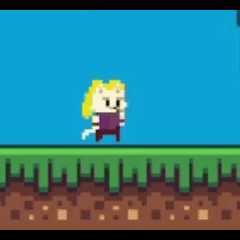
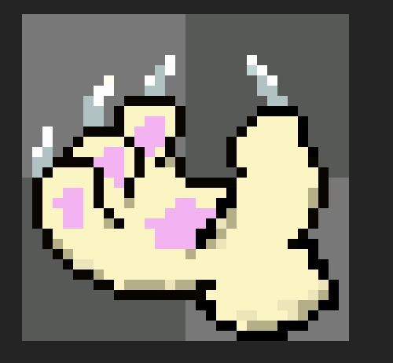
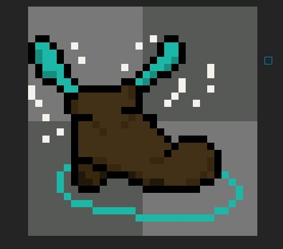
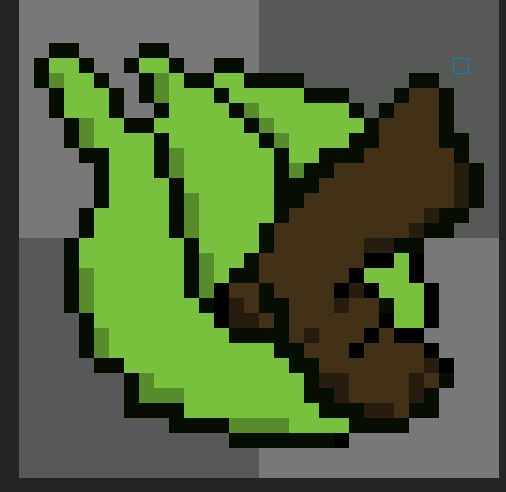
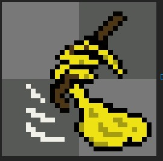
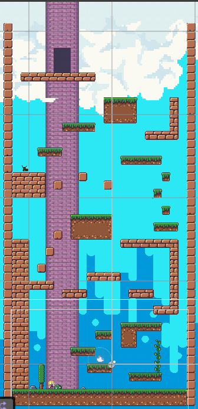
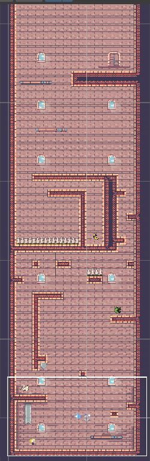
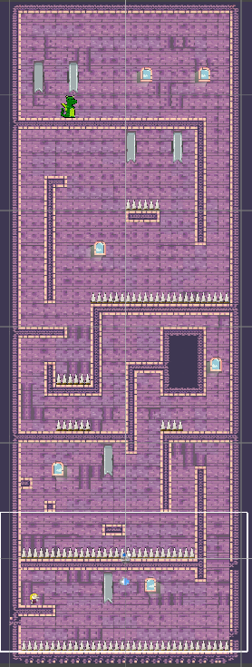
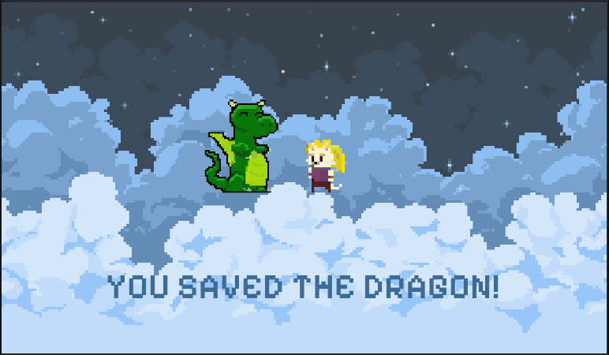

# 🎮 Rapawzel

**Rapawzel** is a 2D parkour platformer game where a **princess cat** must climb a vertical tower, unlocking specialized traversal abilities to reach the top and rescue a dragon.

---

## 🛠 Technologies
- **Engine:** Unity
- **Unity Editor:** 6000.2.6f2
- **Render Pipeline:** Unity Built-in Render Pipeline
- **Programming Language:** C#

---

## 🚀 How to Run
1. Open Unity Hub
2. Click **Open Project**
3. Open the `MainScene`
4. Press ▶️ Play

> The game starts from the **Main Scene**.

---

## 🎮 Controls

| Key | Action |
|---|---|
| A / D | Move |
| Space | Jump |
| Shift | Dash |
| L | Hook (Grappling) |
| Esc | Pause Menu |

---

## 🧠 Game Mechanics
- Health system (2 hearts)
- Trap damage system with red damage flash
- Wall Slide & Wall Jump
- Double Jump
- Dash
- Swing with hair
- Level progression (Level 1–2-3)
- Pause / Restart / Level Select

---
## 🐱 Main Character

---
## 🧰 Collectable Items

### Magic Claws

- Enables wall sliding
- Unlocks wall jumping

---

### Feather Boots

- Grants double jump ability

---

### Swift Boots

- Enables dash movement

---

### Magic Hair

- Unlocks swing mechanic

---

## 🏁 Levels

<table>
  <tr>
    <th>Level 1</th>
    <th>Level 2</th>
    <th>Level 3</th>
  </tr>
  <tr>
    <td align="center">
      
    </td>
    <td align="center">
      
    </td>
    <td align="center">
      
    </td>
  </tr>
</table>

---

## 🖼 Game Screenshots
You can view some in-game screenshots in the  
👉 **[GameScreenshots Folder](./gameScreenshots)**

  
  

---

## 📹 Gameplay Video

👉 **[Watch on YouTube](https://www.youtube.com/watch?v=ge-xv2iSZ7g)**

---

## 📌 Notes
- This project was developed for educational purposes.
- Player abilities are unlocked progressively through item collection.
- This project uses some **publicly available assets**
- Item illustrations and character hair design: Mustafa Çağlar Cömert
